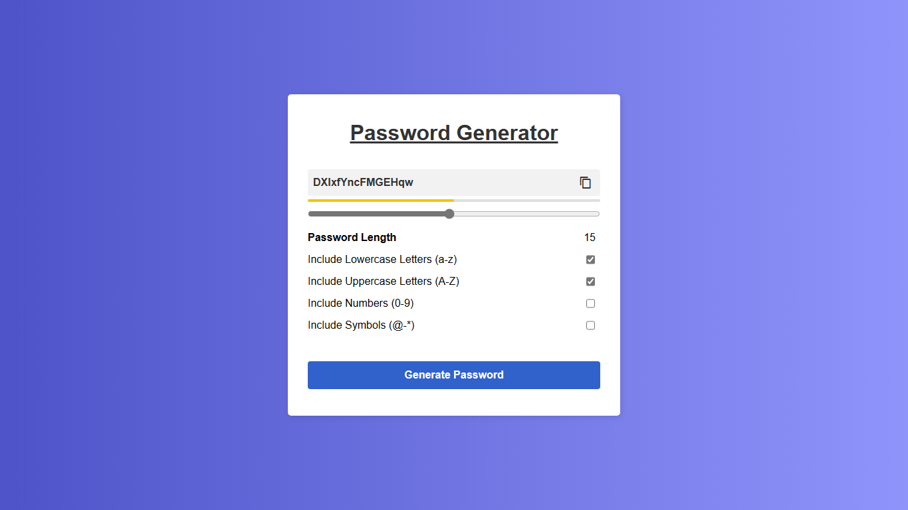

# Random Password Generator

Generate secure passwords with ease! The Password Generator is a user-friendly web application that generates strong and customizable passwords with ease, ensuring enhanced security for online accounts.

## Technologies Used

## Features

- **Customizable Passwords:** Tailor your passwords to your exact specifications by choosing the length and types of characters, including lowercase letters, uppercase letters, numbers, and symbols.

- **Password Strength Indicator:** Gain instant insight into the strength of your passwords with our visual indicator, helping you create robust and secure passwords.

- **Copy to Clipboard:** Easily copy generated passwords to your clipboard with a single click.

## Screenshots

**Check it out :-** [Random Password Generator App](https://generate-random-password-application.netlify.app/)
